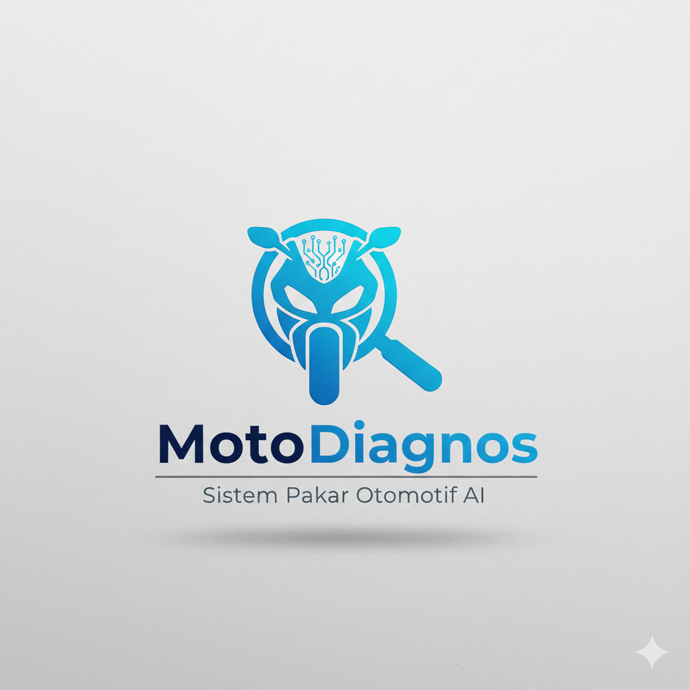
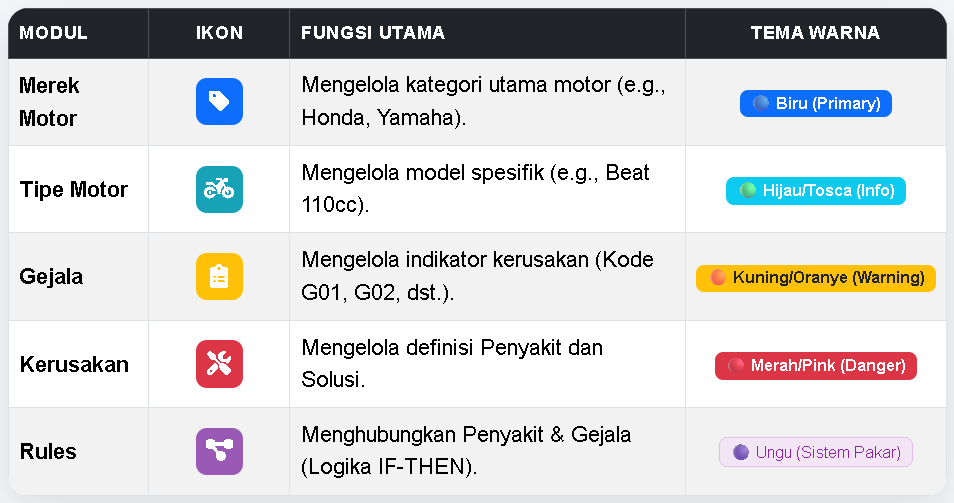

<h1 align="center">🏍️ MotoDiagnos: Sistem Pakar Diagnosa Kerusakan Motor Matic Berdasarkan Tipe dan Gejala</h1>

MotoDiagnos adalah aplikasi sistem pakar berbasis web yang dikembangkan menggunakan Laravel. Proyek ini bertujuan memberikan diagnosis cepat, akurat, dan terstruktur untuk kerusakan umum pada motor matic (Honda & Yamaha) berdasarkan gejala yang diinput pengguna.

---
---

# 🎯 Keunggulan Utama Proyek

Proyek ini menonjol karena fokus pada akurasi logika sistem pakar dan kualitas antarmuka admin yang responsif.

### Akurasi Terukur

Menggunakan metode Forward Chaining untuk menghitung Persentase Kecocokan Gejala terhadap Aturan (Rules), memberikan diagnosis yang terukur (Contoh: Akurasi 75%).

### Struktur Data Spesifik

Basis pengetahuan diikat secara spesifik pada Tipe Motor, mencegah false positive (diagnosis salah) dan memastikan Gejala yang muncul hanya relevan untuk model motor yang dipilih.

### UI/UX Profesional

Desain yang konsisten (menggunakan tema gradien warna unik untuk setiap modul) dan interaktif (seperti counter angka animasi di Dashboard dan input group modern).

### Integrasi & Keamanan

Dilindungi oleh Authentication dan Middleware. Fitur Admin (CRUD) yang lengkap menjamin integritas data sensitif.

---
---

# 🧩 Fitur Aplikasi

## 👤 Antarmuka Pengguna (Diagnosa)

Alur Dinamis: Input bertingkat (Merek → Tipe → Gejala) didukung oleh AJAX.

Laporan Akhir: Menyajikan Penyakit, Tingkat Akurasi, Deskripsi Kerusakan, dan Saran Solusi yang praktis.

## 🔐 Panel Administrasi (CRUD)

Admin Panel menyediakan tools lengkap untuk memelihara Basis Pengetahuan:

---
---

# ⚙️ 🛠 Teknologi yang Digunakan

- Backend: Laravel 12+ / PHP 8+

- Database: MySQL

- Arsitektur: MVC, Rule-Based Expert System (Forward Chaining)

- Frontend: Blade Template, Bootstrap 4/5, jQuery (Full), Font Awesome

---
---
## 🚀 Instalasi dan Menjalankan Proyek

### Clone Repositori:

- `git clone https://github.com/elnino27-web/motoDiagnos.git`

- `cd motoDiagnos`

### Install Dependencies:

- `composer install`

### Setup Environment:

- `cp .env.example .env`

- `php artisan key:generate`

### Edit konfigurasi database di file .env.

### Migrasi Database (dan Seeder):

### Membuat tabel dan mengisi user admin
- `php artisan migrate:fresh --seed`

### Jalankan Server:

- `php artisan serve`

- Akses melalui: http://localhost:8000

---
---
## 🔐 Kredensial Admin Default

- Email: admin@motodiagnos.com

- Password: password
---
---
---
# Terima kasih telah mengunjungi repositori ini.
